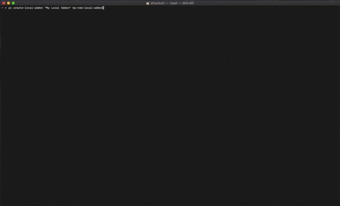
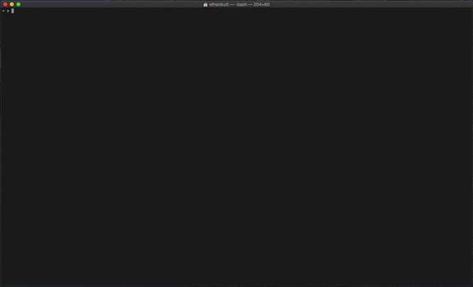

# Create Local Add-on
A generator to assist in the development of new Local add-ons. Generates a basic add-on to act as a starting point for development.

So you want to create your own Local add-on? Look no further! This generator can help you get up and running in no time with your own add-on.


## Local Add-ons
Local is even better with add-ons! Add-ons can add extra functionality and convienience to your development workflow. There are some amazing add-ons already available for Local in the add-on marketplace –– but the best add-ons could be the ones you make yourself! This generator is designed to help you get started building your own add-on with little effort; it takes care of all the setup and lets you focus on making an amazing new add-on for the Local application.

Once you are done, you can easily use your add-on within Local to enhance your workflow. If you want to go a step further, you can even submit your add-on to be added to the public Local add-on marketplace!

## What You'll Need Before Starting
Here are a few things you'll want to make sure you have set up before using the Local Add-on Generator.

- Node.js ([link to downloads](https://nodejs.org/en/download/), [link to distributions list](https://github.com/nodesource/distributions/blob/master/README.md#deb))

	Check node installation: `node --version`
	
	> If you need to upgrade or install Node, the easiest way is to use an installer for your platform. Download the .msi for Windows or .pkg for Mac from the [NodeJS website](https://nodejs.org/).

- NPM ([link to full instructions](https://www.npmjs.com/get-npm))

	Check npm installation: `npm --version`

	> The npm package manager is bundled with Node, although you might need to update it. Some Node versions ship with rather old versions of npm. You can update npm using this command: `npm install --global npm@latest`

- Yeoman ([link to full instructions](https://yeoman.io/codelab/setup.html))

	Check yo installation: `yo --version`

	> Install the Yeoman toolset: `npm install --global yo`  

#### For Our Windows Users

The Local Add-on Generator makes use of symlinks to make sure Local knows about your add-on. By default, your Windows machine may not support symlinks; however, there are many different ways to add symlink support to Windows ([Git Bash](https://gitforwindows.org), [WSL](https://docs.microsoft.com/en-us/windows/wsl/install-win10), etc). If symlinks are not supported by your Windows machine, the Local Add-on Generator will skip that step during setup. Alternatively, the Local Add-on Generator could be operating with insufficient permissions to create a symlink, which will result in the same outcome as with a lack of symlink support. We are actively working to improve this part of the add-on setup process.  

**Note**: if you do not set the `--place-directly` flag and symlinks are not supported by your machine, your add-on will not be automatically built or enabled within the Local application (you can still perform these steps manually later).

## Getting Started
Install the Local Add-on Generator:

```
npm install create-local-addon
```

Run the Local Add-on Generator:

```
create-local-addon --verbose
```

You can also run the generator using `npx`:

```
npx create-local-addon --verbose
```

## Usage
The *Create Local Add-on* generator is designed to get you started with minimal setup. 

The only required information you have to supply is **the product name** for your new add-on and **a name for the directory** where the files for your add-on will be placed. You can suppply both of these as command line arguments to the generator; if you do not give one or both in the command line, you will be prompted to supply them.

By default, the generator will pull down a basic boilerplate add-on, set up this new add-on in your current directory, symlink the add-on into the Local add-ons directory, and enable the add-on within the Local application. You choose to skip/tweak each of these default steps by using flags:

* using `--place-directly` will place your new add-on directly into the Local add-ons directory (rather than your current directory).
* using `--do-not-symlink` will not symlink your new add-on into the Local add-ons directory (automatically added if `--place-directly` is used).
* using `--disable` will not enable your new add-on in the Local application.

If you are developing this add-on for Local Beta, you can designate this preference with the `--beta` flag.
Note: if you use the `--beta` flag, but no installation of Local Beta is found, your add-on will be installed for the normal Local application.


**If the bash help layout is more your style:**

```
Usage:
    yo create-local-addon [<productname>] [<directoryname>] [options]

Options:
            --help               # Print the generator's options and usage

            --beta               # Preference to install add-on for Local Beta                                                         Default: false

            --place-directly     # Place add-on directory directly into Local add-ons directory (automatically adds --do-not-symlink)  Default: false
            --do-not-symlink     # Skip creating a symbolic link in Local add-ons directory to your add-on directory                   Default: false
            --disable            # Skip building and enabling add-on                                                                   Default: false

            --verbose            # Print more detailed information and status updates during the setup process                         Default: false
            --show-error-traces  # Print full error messages on occurrence                                                             Default: false

Arguments:
    productname    # Product/display name for the new add-on     Type: String  Required: false
    directoryname  # Directory/internal name for the new add-on  Type: String  Required: false
```
### Examples

The standard installation process looks something like this:


  
**Verbose Mode**: if this is your first time creating a Local add-on or you want more information on the setup process, you may find it helpful to add the `--verbose` flag (see example below).



## More Help

* **Setup Errors**: by default, full traces for errors that occur during installation are silenced. If you want the full trace for errors to be printed into the terminal, you can used the `--show-error-traces` flag. Error traces will be printed just before the associated error or warning message is displayed.
* **Add-on Names with Spaces**: if you want to create an add-on with spaces in it, you can enclose the name in double-quotes (as a command line argument). These quotes are not necessary if you provide the name to the generator prompt.
* **Add-on Won't Enable**: there are a few reasons your new add-on may not be enabled automatically.
	1. 	Make sure you did not set the `--disable` flag (we know, but it doesn't hurt to double check, right?).
	2. In order to enable your add-on, either the directory for your add-on must be in the local add-ons directory or a symlink must exist in the local add-ons directory pointing to your add-on directory. Therefore, if you use the `--do-not-symlink` flag without adding the `--place-directly` flag, your add-on cannot be enabled automatically.
	3. By necessity, the generator will use **npm** to install and build your add-on's dependencies before enabling it (you can also use **yarn**). If this process fails, your add-on cannot be enabled. Ensure that the build process was successful; if not, you can look at performing these steps manually (listed below).
	4. If Local is already running when you create your add-on, you will need to restart Local to see your add-on appear.

#### Local Add-on Directory
Add-on directories must be placed or linked into the Local add-ons directory to appear within the Local appplication. The generator will create a symlink in the Local add-ons directory pointing to your add-on by default; if you skip this step, you will need to link the directory manually.

**Local add-on directories:**

- macOS: `~/Library/Application Support/Local/addons`
- Windows: `C:\Users\username\AppData\Roaming\Local\addons`
- Debian Linux: `~/.config/Local/addons`

#### Building/Enabling Your Add-on Manually
**Note**: these steps are intended primarily for those who used the `--disable` flag during setup.  
If you wish to see your add-on displayed in Local and enable it, you must make sure to install/build your add-on's dependencies:

```
cd ~/.../your-new-local-addon  # navigate to your add-on directory
npm install  # install add-on dependencies
npm run build  # Run add-on build script
```

Or using **yarn**:

```
cd ~/.../your-new-local-addon  # navigate to your add-on directory
yarn  # install add-on dependencies
yarn build  # Run add-on build script
```

You should now be able to enable your add-on within the Local application.


## Next Steps
Here are some tips to help you get started after you have used the generator to set up your add-on.

Note: if Local is already running when you create your add-on, you will need to restart Local to see your add-on appear.

### Making changes to your add-on:
After your basic add-on has been created, you can change your add-on by making changes to the source files:

`~/.../your-new-local-addon/src`

*Boilerplate.jsx and renderer.jsx will have some basic logic in them to give you a starting point, but you'll probably want to make some changes.*

---

You can compile, watch add-on source files, and trigger recompilation on change:

```
cd ~/.../your-new-local-addon  
npm run build --watch
```

Or using **yarn**:

```
cd ~/.../your-new-local-addon  
yarn build --watch
```

*You can leave the --watch flag off if you just want to compile your changes once.*

## Other Resources
* [Local Homepage](https://localwp.com/)
* [Add-on Resources](https://localwp.com/get-involved)
* [Building a Local Add-on](https://localwp.com/get-involved/build)
* [Local Add-on API](https://github.com/getflywheel/local-docs-addon-api)
* [Submit an Add-on to the Local Marketplace](https://localwp.com/submit-addon)